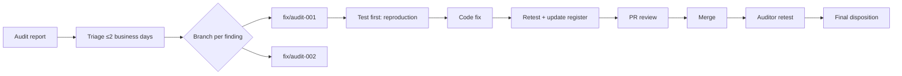

# Audit Fix-Sprint Process

- **Cross-reference**: [ROADMAP.md](../../ROADMAP.md) P5-02, P5-08 (go/no-go)
- **Pre-requisite**: External audit report received with findings register

---

## Process overview

## 1. Triage (≤2 business days of report receipt)

1. Read every finding. Classify:
   - **P0 — Critical/High**: Blocks mainnet go/no-go unless explicitly Accepted with risk owner.
   - **P1 — Medium**: Should fix before mainnet but may be Accepted with documented rationale.
   - **P2 — Low / Info**: Nice-to-have; fix if trivial, else accept.
2. Assign owner to each finding.
3. Register all findings in `docs/security/audit-findings-register.md` with status `Open`.
4. Notify team: kick-off fix sprint.

## 2. One finding → one branch

- Branch naming: `fix/audit-<ID>` (e.g. `fix/audit-001`).
- No bundling: **one finding per branch**. If two findings touch the same contract, create separate branches and merge sequentially.
- Exception: documentation-only findings (e.g. comment typos, natspec) may be batched in a single branch `fix/audit-docs`.

## 3. Test first (reproduction)

Before writing the fix:
1. Write a test that reproduces the vulnerability or demonstrates the incorrect behavior.
2. If the finding is a logical bug (e.g. wrong comparison), the test must fail with the original code.
3. For informational findings (e.g. gas optimization), a benchmark diff is sufficient.
4. Commit the reproduction test: `git commit -m "test: reproduce AUD-001 — ..."`

## 4. Fix

- Fix the contract code in `contracts/` or API ton client in `apps/api/src/ton/` (note: `apps/api/src/ton/` does not exist yet — create if needed).
- **Never fix by modifying Mini App components** (`src/app`, `src/components`). Contract and API ton-client code are the only valid fix locations.
- Follow the existing code style of the contract package.
- After fix, verify the reproduction test passes.
- Run the full contract test suite: `npm test` under `contracts/`.
- Do not bundle unrelated refactors into the fix branch.

## 5. Register update

After the fix is committed:
- Update `docs/security/audit-findings-register.md`:
  - Status → `Fixed`
  - PR → link to PR
  - Owner → engineer
- If the finding is **Accepted** (not fixed):
  - Status → `Accepted`
  - Add a note with the risk owner and rationale.

## 6. PR review

- Standard PR review (2 reviewers minimum for Critical/High).
- The reproduction test must be visible in the PR diff.
- Merge only after CI passes (`npm run test:contracts`, `npm run lint`).

## 7. Auditor retest

- After merge, deploy the fixed contracts to the audit testnet environment.
- Provide the auditor with:
  - New commit SHA
  - Updated testnet addresses
  - Reproduction test output
- The auditor updates each finding: Retest → PASS / FAIL / Not Yet Tested.
- If FAIL: repeat from step 2.

## 8. Final disposition

- All Critical/High findings must be `Fixed` or `Accepted` with named risk owner.
- `docs/security/audit-findings-register.md` is the single source of truth for go/no-go.
- P5-08 (go/no-go meeting) reads the register to make the final call.

## Roles

| Role | Person (fill) |
|---|---|
| Fix owner | Engineer assigned per finding |
| PR reviewer | Senior engineer / tech lead |
| Findings register keeper | Tech lead or security lead |
| Auditor contact | Designated liaison |
| Go/no-go decider | ROADMAP P5-08 sign-off meeting |

## Escalation

If a fix cannot be completed within the sprint (e.g. requires an ADR change, protocol redesign):
1. File a finding with severity as-is.
2. Propose an ADR amendment or design change.
3. The finding remains `Open` until the ADR is accepted and the fix lands.
4. Go/no-go is blocked until the finding is resolved or explicitly Accepted.
