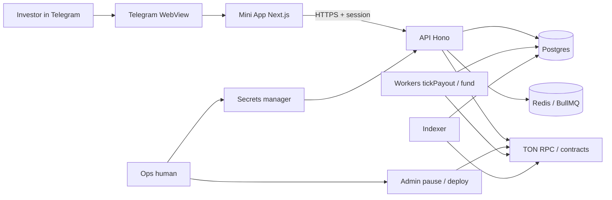

# DigiHouse — Threat Model v0

- Status: Draft
- Date: 2026-07-29
- Method: STRIDE-lite
- Scope: Mini App + future API + TON testnet/mainnet path (Phases 0–5)
- Out of scope: full formal verification, nation-state APT playbooks, physical office security, external audit engagement (P5-02)

## 1. System summary

DigiHouse is a Telegram Mini App for fractional property shares and weekly rent on TON. Today the app uses **mock repos**. Phase 1 adds API + Postgres; Phase 2–3 add jettons, claim-based distribution, and an indexer. Honesty of “simulated vs on-chain” is a first-class security/trust control (ADR-001).



```text
  User wallet (TonConnect) ──sign──► chain
  Mini App ──never──► private keys / bot token / deployer
  Mock path: getRepo() → in-memory   |   API path: getRepo() → HttpRepos
```

## 2. Assets

| Asset | Why it matters |
|---|---|
| User sessions (JWT / cookie) | Impersonation → steal portfolio actions |
| Holdings / orders / earnings ledger | Financial truth in hybrid; must match chain in onchain |
| Rent float (hot wallet + distribution balance) | Direct monetary loss |
| Product honesty / trust | Regulatory and investor damage if fake “on-chain” claims |
| Deployer / admin / bot / session secrets | Full platform compromise |
| Telegram-linked PII (user id, name, photo) | Privacy; phishing personalization |
| Jetton supply integrity | Dilution / double-mint |
| Audit trail | Repudiation defense |

## 3. Actors

| Actor | Intent |
|---|---|
| End user (investor) | Legitimate buy/hold/claim/sell |
| External attacker | Steal funds/sessions, manipulate books, deface trust |
| Malicious or compromised insider ops | Mint, drain float, unpause fraudulently |
| Compromised dependency / supply chain | Backdoor build or runtime |
| Honest-but-buggy indexer/API | Wrong balances without malice |

## 4. Trust boundaries

| Boundary | What crosses | Rule |
|---|---|---|
| Telegram WebView ↔ Mini App | `initData`, theme, viewport | Treat `initData` as untrusted until API HMAC verify (P1-04) |
| Mini App ↔ API | HTTPS, session, repo-shaped JSON | UI → hooks → HttpRepos only; no secrets in client (ADR-004) |
| API ↔ Postgres/Redis | SQL / jobs | Server-only credentials; no open admin |
| API/workers ↔ TON | RPC, deploy, fund, read events | Capped hot wallet; admin pause (ADR-003/004) |
| Ops human ↔ SM / admin | Keys, pause | Dual-control on prod; never Mini App |
| Mock vs API data path | `NEXT_PUBLIC_DATA_SOURCE` | Does **not** imply settlement honesty (ADR-001) |
| Public OpenAPI vs session routes | See `docs/openapi/digihouse-v0.yaml` | Public: healthz, auth, marketplace reads; session: orders, portfolio, earnings, buys |

## 5. Risk register

| ID | Threat | STRIDE | Asset | Sev | Like | Mitigation | Task / ADR |
|---|---|---|---|---|---|---|---|
| TM-01 | **initData forgery / replay** — fake or expired Telegram auth → forged session | S | Sessions, ledger | H | M | HMAC verify bot token; reject bad/expired `auth_date`; fail closed; no client-side “trust initData” | P1-04, P1-05, ADR-004 |
| TM-02 | **IDOR on orders** — `DELETE /v1/orders/{id}` cancels another user’s order | T/E | Orders | H | M | Authorize maker == session user; 403 tests; never trust client `userId` | P1-11, OpenAPI |
| TM-03 | **IDOR on portfolio/earnings** — read or act on another user’s books | I/T | Holdings, earnings | H | M | Caller-scoped queries only; no userId path param for self resources | P1-09, P1-10 |
| TM-04 | **Buy confirm IDOR / intent hijack** — confirm another user’s `intentId` or forge confirm without prepare | T/E | Holdings, float | H | M | Bind intent to session; one-time intent; expiry; 409 on reuse | P1-12 |
| TM-05 | **Hot wallet drain** — stolen payout/fund key or unlimited top-up | E/T | Rent float | H | M | Caps, minimal balance, monitoring, separate keys, pause on incident | ADR-004, P0-07, P5-05/06 |
| TM-06 | **Indexer lag / missed events** — double credit, stuck pending, chain≠DB | T/R | Holdings, earnings | H | M | Idempotent event_id; reconciliation job; resync tools; don’t mark paid without event | P3-01…03, P3-06 |
| TM-07 | **Honesty / badge bypass** — UI claims on-chain while mock/hybrid; hide simulated without real hash | T/I | Trust | H | H | ADR-001 gates; design-review; SETTLEMENT_MODE + real txHash + explorer URL required | ADR-001, P3-10, design-review |
| TM-08 | **Rate abuse** — spam `placeOrder`, auth, `prepareBuy`; scrape marketplace | D | API availability, UX | M | H | Rate limits per IP/user; auth backoff; optional CAPTCHA later | P4-05 area, P1-18 smoke |
| TM-09 | **Unbounded distribution gas** — single-TX push all holders returns | D | Payouts, relayer | H | L | Claim-based MVP; forbid unbounded loop; batch max if ever enabled | ADR-003, P2-04, P2-07 |
| TM-10 | **Mock→live honesty failure** — product markets “live rent” while ledger is DB-only | I | Trust, legal | H | M | Mode ladder; QA exit criteria; no silent cutover on `DATA_SOURCE=api` | ADR-001, Phase 1/3 exit |
| TM-11 | **Session theft (XSS / token leak)** — steal bearer from JS or storage | S/I | Sessions | H | M | Prefer httpOnly cookie; CSP; no token in logs; short TTL; XSS hygiene | P1-05, P1-16, P5-01 |
| TM-12 | **TonConnect phishing / wrong manifest** — user signs hostile payload | S/T | User funds | H | M | Correct manifest URL; prepare shows clear amounts; testnet default; user education | TECH_STACK, P1-12, P3-04 |
| TM-13 | **Insider malicious mint / pause abuse** — admin mints shares or unpauses fraud | E/T | Supply, trust | H | L | Multisig/timelock mainnet; audit_events; dual-control; access tests | ADR-004, P1-14, P2-06, P4-03 |
| TM-14 | **Underfunded pool marked paid** — earnings flip without rent funded | T | Earnings honesty | H | M | ADR-003 underfunded block; no paid without fund/claim event | ADR-003, P1-13, P3-03 |
| TM-15 | **Synthetic txHash as “explorer-real”** — link `simulated:` to tonviewer | I | Trust | M | H | Explorer only if non-`simulated:` + buildable URL (ADR-001 §4) | ADR-001, P3-07 |
| TM-16 | **Secrets in git / client bundle** — bot token or keys in `NEXT_PUBLIC_*` or repo | I/E | All secrets | H | M | SM only; secret scan; never public env for secrets; rotate if leaked | ADR-004, P0-07, P5 |
| TM-17 | **Open or unauth tickPayout** — public/worker route flips all pending→paid | T/E | Earnings ledger | H | M | Worker-only; no Mini App route; internal auth/network; idempotency key | P1-13, OpenAPI note |
| TM-18 | **CSRF on cookie sessions** — cross-site state-changing calls | T | Orders, buys | M | M | SameSite cookies; CSRF token or bearer-preferred for mutations | P1-05, P1-16 |
| TM-19 | **Legal/geo mischaracterization of “shares”** — product treated as unregistered security in a geo | — | Continuity | H | M | Counsel; disclosures; geo/KYC gates later; no guaranteed-yield claims | ROADMAP §7, Phase 5 legal, ADR-001 §7 |
| TM-20 | **Single RPC / reorg blindness** — wrong confirmations, false mint credit | T | Holdings | M | M | Don’t trust single RPC; confirmation depth policy; recon | P3-01, P3-06 |
| TM-21 | **Supply-chain npm compromise** — malicious dependency in web/api | E/T | Full stack | H | L | Lockfiles; CI audit; pin versions; minimal deps; Phase 5 scan | P5, CI |
| TM-22 | **Batch relayer key abuse** (if ADR-003 B enabled later) — drain via push path | E/D | Float | H | L | Separate key; stricter cap; rate limit; off by default | ADR-003/004, P2-07 |

Severity = impact if realized. Likelihood = rough prior before controls. Neither column is residual risk after mitigation.

## 6. Required risks deep-dive

### TM-01 — initData forgery

- **Path:** Attacker crafts/replays `initData` without valid bot HMAC, or uses leaked `TELEGRAM_BOT_TOKEN` to mint valid payloads → `POST /v1/auth/telegram` issues session as victim or fake user.
- **Blast radius:** Full account takeover of API-scoped actions (orders, buys, portfolio).
- **Detection:** Spike in auth failures; sessions for unknown telegram ids; token rotation alerts.
- **Mitigation:** Server-side HMAC with bot token from SM; expiry window; fail closed unit tests; token never in client. **P1-04, P1-05, ADR-004.**

### TM-02 / TM-03 — IDOR orders / portfolio / earnings

- **Path:** Authenticated user A calls `DELETE /v1/orders/{id}` or reads resources with B’s ids; or API trusts body `userId`.
- **Blast radius:** Cancel others’ liquidity; privacy leak of holdings/earnings; market griefing.
- **Detection:** 403/404 metrics; audit log on cancel; cross-user access tests in CI.
- **Mitigation:** Session principal is sole scope key; integration tests user B cannot cancel A. **P1-09, P1-10, P1-11.**

### TM-04 — Buy confirm abuse (related IDOR)

- **Path:** Guess/reuse `intentId` on `POST /v1/buys/confirm` to attach holdings to attacker or drain funding caps.
- **Blast radius:** Incorrect holdings; inventory theft in hybrid ledger.
- **Detection:** Confirm without matching prepare; multi-confirm attempts.
- **Mitigation:** Intent bound to user + expiry + single use. **P1-12.**

### TM-05 — Hot wallet drain

- **Path:** Leak of rent-float key from CI/logs/SM misconfig; or ops leaves uncapped balance; future batch relayer signs unbounded sends.
- **Blast radius:** Loss of weekly rent float (not user custody wallets, but ops treasury).
- **Detection:** Balance > cap or sudden outflow alerts; failed/anomalous fund txs.
- **Mitigation:** Interim caps (ADR-004); claim model reduces push surface; pause + sweep runbook. **ADR-004, P2-12, P5-05/06.**

### TM-06 — Indexer lag / missed events

- **Path:** Buy or claim confirmed on-chain but indexer misses event; or event applied twice without idempotency.
- **Blast radius:** Users see wrong portfolio; double shares; paid without proof or unpaid with proof.
- **Detection:** Nightly recon chain vs DB; lag SLOs; alert on gap.
- **Mitigation:** Unique `event_id`; rebuild holdings job; never UI-paid without hash rules. **P3-01…03, P3-06.**

### TM-07 — Honesty / badge bypass

- **Path:** Client or bad flag hides “simulated” when `SETTLEMENT_MODE≠onchain` or `txHash` is `simulated:…`; marketing copy says rent “in your wallet.”
- **Blast radius:** Regulatory/trust damage (ROADMAP Mock→live); investor demo lies.
- **Detection:** Design-review checklist; e2e asserts on disclaimer; code review of badge helpers.
- **Mitigation:** Hard gates ADR-001 §4; `DATA_SOURCE=api` alone never hides chrome. **ADR-001, P3-10, design-review / ownership skill.**

### TM-08 — Rate abuse

- **Path:** Flood `POST /v1/auth/telegram`, `POST /v1/orders`, `POST /v1/buys/prepare`; scrape `GET /v1/marketplace`.
- **Blast radius:** API cost/outage; order-book noise; intent table bloat.
- **Detection:** Rate-limit metrics; anomaly QPS per IP/user.
- **Mitigation:** Per-route limits; backoff on auth; load smoke baseline. **P4 rate limits, P1-18.**

## 7. STRIDE coverage checklist

| Letter | Covered by |
|---|---|
| **S** Spoofing | TM-01, TM-11, TM-12 |
| **T** Tampering | TM-02–04, TM-06, TM-07, TM-14, TM-17, TM-18, TM-20 |
| **R** Repudiation | TM-06 (audit/recon); mitigated by **P1-14** `audit_events` on buy/cancel/payout |
| **I** Info disclosure | TM-03, TM-07, TM-15, TM-16 |
| **D** DoS | TM-08, TM-09, TM-22 |
| **E** Elevation | TM-02, TM-04, TM-05, TM-13, TM-17 |

## 8. Residual risk and acceptance

| Residual | Why accepted (v0) | Revisit |
|---|---|---|
| User signs wrong TonConnect payload despite UX | Wallet UX is external; we reduce via clear prepare amounts | P3 buy path UX |
| Multisig not ready on day-one testnet | Staged custody ladder ADR-004 | Before mainnet go/no-go P5-08 |
| Legal characterization | Needs counsel, not eng alone | Phase 5 legal checklist |
| Supply-chain zero-days | Industry residual | P5 scans + pins |
| Single-geo regulatory surprise | Geo matrix incomplete | Open Q below |

**v0 acceptance:** This register is sufficient to prioritize Phase 1 authz/authn and ADR-aligned honesty; it is **not** a pen-test report.

### Open questions (max 5)

1. Cookie vs bearer default for Mini App (CSRF vs XSS tradeoff) — decide in P1-05/P1-16.
2. Confirmation depth / reorg policy numbers for testnet vs mainnet — P3-01.
3. Exact prod hot-wallet cap formula (1-week float vs fixed nano) — P0-07 / mainnet checklist.
4. Whether admin API is separate host or path prefix with stronger auth — P4-03.
5. Geo allowlist source of truth (config vs third-party) — Phase 5 legal.

## 9. References

- [EXECUTION-PLAN.md](../../EXECUTION-PLAN.md) — P0-06 acceptance
- [ROADMAP.md](../../ROADMAP.md) — §3.3 boundaries; §7 risk register; Phase 5 security
- [ADR-001](../adr/ADR-001-settlement-modes.md) — settlement honesty / badges
- [ADR-002](../adr/ADR-002-jetton-factory.md) — deploy authority
- [ADR-003](../adr/ADR-003-distribution-model.md) — claim, underfunded, pause, gas
- [ADR-004](../adr/ADR-004-key-hierarchy.md) — keys, caps, secrets
- [docs/openapi/digihouse-v0.yaml](../openapi/digihouse-v0.yaml) — route auth surface
- [src/lib/api/repos.ts](../../src/lib/api/repos.ts) — current trust boundary (mock behind interfaces)
